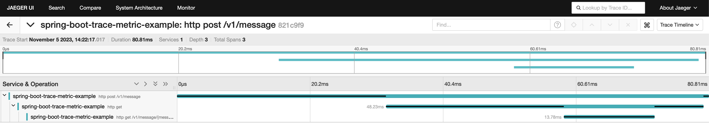
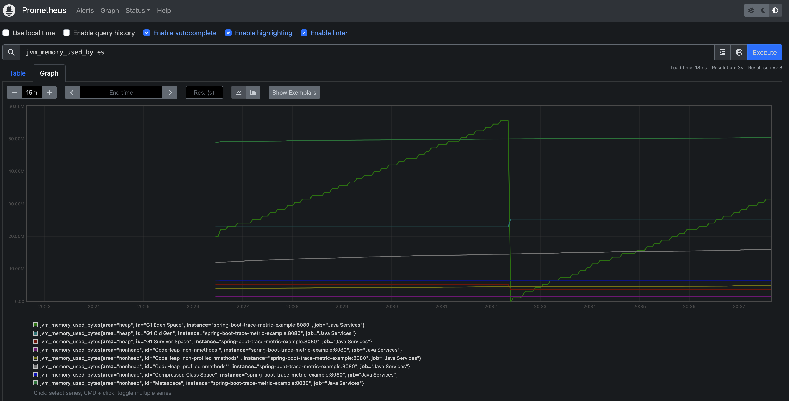

# Spring Boot Trace and Metric

Spring Boot 3 demonstration using Observability implementing:

- Tracing with Jaeger and micrometer-tracing-bridge-otel/opentelemetry-exporter-zipkin
- Metrics with Prometheus and micrometer-registry-prometheus

---
## Justification

Implementing Jaeger for tracing, Prometheus for metrics in a Spring Boot project oriented toward production support is essential for enhancing visibility, diagnosing issues, proactively monitoring performance, optimizing resource utilization, ensuring security and compliance, and scaling effectively. These open-source tools empower real-time alerts, historical analysis, and integration with various services while remaining cost-effective and benefiting from robust community support. This comprehensive approach is crucial for maintaining a high level of system reliability and efficiency in a production environment.

---
## Requirements

* Docker 24.0.6
* Make 3.81
* Java 21
* Maven 3.9.5
* [Jaeger 1.50.0](https://github.com/EightAugusto/development-infrastructure-provider) 
* [Prometheus v2.47.2 ](https://github.com/EightAugusto/development-infrastructure-provider)

---
## Run

```bash
source .env; \
mvn clean install; \
java \
-Dserver.port=${APPLICATION_PORT} \
-jar target/${APPLICATION}.jar
```
or
```bash
mvn clean install; \
make docker.start
```

---
## Demonstration

### Tracing

Once the application is running you can execute the following command to trigger a simple REST call from the local service to the local service.
```bash
curl -X POST 'http://localhost:8080/v1/message'
```

The previews command will allow Jaeger, based on the *application.yml* file with the following configuration.
```yml
management.zipkin.tracing.endpoint: http://localhost:9411/api/v2/spans
```

Create a complete trace of the 2 flows (**POST /v1/message** and **GET /v1/message/{message}**).


Additionally, in logs, you can see the *traceId* beeing shared between each flow.
```bash
 2023-11-05T20:22:17,044 [spring-boot-trace-metric-example] TRACE [http-nio-8080-exec-1] [{traceId=821c9f9fbed2ce64aed490c2f675f961, spanId=ebc78e59b8c969c1}] c.e.s.b.t.m.m.c.MessageController.postMessage:22 - Enter ()
 2023-11-05T20:22:17,045 [spring-boot-trace-metric-example] TRACE [http-nio-8080-exec-1] [{traceId=821c9f9fbed2ce64aed490c2f675f961, spanId=ebc78e59b8c969c1}] c.e.s.b.t.m.m.s.i.MessageServiceImpl.postMessage:42 - Enter ()
 2023-11-05T20:22:17,081 [spring-boot-trace-metric-example] TRACE [http-nio-8080-exec-2] [{traceId=821c9f9fbed2ce64aed490c2f675f961, spanId=a6c8a30280af0040}] c.e.s.b.t.m.m.c.MessageController.getMessage:29 - Enter ()
 2023-11-05T20:22:17,082 [spring-boot-trace-metric-example] TRACE [http-nio-8080-exec-2] [{traceId=821c9f9fbed2ce64aed490c2f675f961, spanId=a6c8a30280af0040}] c.e.s.b.t.m.m.s.i.MessageServiceImpl.getMessage:34 - Enter (e20bcf63-35d9-460b-b819-402a634b40f1)
 2023-11-05T20:22:17,082 [spring-boot-trace-metric-example] INFO  [http-nio-8080-exec-2] [{traceId=821c9f9fbed2ce64aed490c2f675f961, spanId=a6c8a30280af0040}] c.e.s.b.t.m.m.s.i.MessageServiceImpl.getMessage:35 - Received message: 'e20bcf63-35d9-460b-b819-402a634b40f1'
 2023-11-05T20:22:17,082 [spring-boot-trace-metric-example] TRACE [http-nio-8080-exec-2] [{traceId=821c9f9fbed2ce64aed490c2f675f961, spanId=a6c8a30280af0040}] c.e.s.b.t.m.m.s.i.MessageServiceImpl.getMessage:36 - Exit
 2023-11-05T20:22:17,082 [spring-boot-trace-metric-example] TRACE [http-nio-8080-exec-2] [{traceId=821c9f9fbed2ce64aed490c2f675f961, spanId=a6c8a30280af0040}] c.e.s.b.t.m.m.c.MessageController.getMessage:31 - Exit
 2023-11-05T20:22:17,097 [spring-boot-trace-metric-example] TRACE [http-nio-8080-exec-1] [{traceId=821c9f9fbed2ce64aed490c2f675f961, spanId=ebc78e59b8c969c1}] c.e.s.b.t.m.m.s.i.MessageServiceImpl.postMessage:45 - Exit
 2023-11-05T20:22:17,097 [spring-boot-trace-metric-example] TRACE [http-nio-8080-exec-1] [{traceId=821c9f9fbed2ce64aed490c2f675f961, spanId=ebc78e59b8c969c1}] c.e.s.b.t.m.m.c.MessageController.postMessage:24 - Exit
```

### Metrics

Spring Boot will expose prometheus endpoint based on the use of [actuators](https://docs.spring.io/spring-boot/docs/1.4.0.M2/reference/html/production-ready-monitoring.html) and the *micrometer-registry-prometheus* implementation.

The following configuration will allow Spring to expose prometheus actuator.
```yml
management:
  endpoint.prometheus.enabled: true
  endpoints.web.exposure.include: prometheus
```

Once deployed, you can manually request the current service metrics using the following command.
```bash
curl 'http://localhost:8080/actuator/prometheus'
```

The previous configuration can be pulled using prometheus scraper configuring the *prometheus.yml* with the previous endpoint, i.e.: 
```yml
scrape_configs:
  - job_name: 'Java Services'
    metrics_path: '/actuator/prometheus'
    scrape_interval: 5s
    static_configs:
      - targets: ['spring-boot-trace-metric-example:8080']
```

With the previous done, you can request metrics using Prometheus Dashboard, i.e.:

